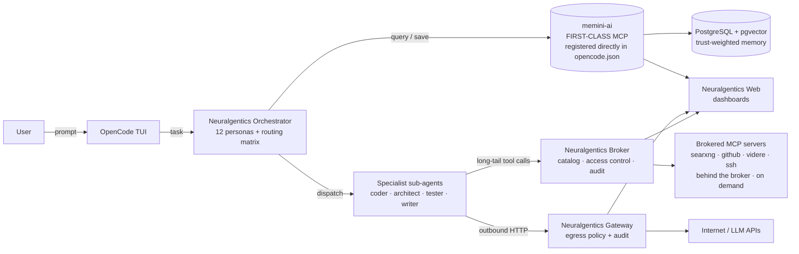

# neuralgentics-broker


[](https://go.dev/)
[](LICENSE)

AI agents see too many tools, and every tool call should be auditable. The
neuralgentics-broker sits between an MCP client (an LLM agent) and the MCP
servers it talks to, cuts the tool-list token footprint by roughly 95%
(12,800 tokens down to ~600), enforces role-based access per server and
tool, and records every call to JSONL and/or Postgres.

## What it does

- Spawns and supervises MCP server subprocesses (stdio, HTTP, and SSE
  transports) and restarts them on exit
- Proxies JSON-RPC `tools/call` requests between a client and the
  registered servers, propagating session IDs end-to-end
- Builds a role-filtered server catalog so each agent persona only sees
  the tools it is allowed to call
- Matches free-text intents to the best server/tool pair using a Jaccard
  similarity scorer with capability-tag bonuses
- Records every tool call (success, failure, and denied) to JSONL and/or
  the `broker_audit_log` Postgres table
- Hot-reloads the server config on `SIGHUP` without dropping in-flight
  connections
- Optionally routes the servers' outbound HTTP through the
  `neuralgentics-gateway` egress proxy for policy enforcement and audit

## Architecture

The broker is organized as three cooperating layers: a **server catalog**
that builds a role-filtered view of every available server and skill, an
**intent matcher** that picks the best server/tool pair for a natural-
language intent, and an **access control** layer that gates which roles
can see which servers and call which tools. Every catalog read and every
`Call` goes through access control before reaching a server, and every
call is recorded by the audit writer.


memini-ai is a **first-class** MCP server — registered directly in `opencode.json` and always loaded. Every other MCP server sits **behind the broker**: catalog-advertised, access-controlled, and brokered on demand, which keeps long-tail tool schemas out of every prompt.


The full call-flow diagram is in the
[Architecture guide](https://veedubin.github.io/neuralgentics-broker/architecture/).

## Quickstart

Install the `broker` binary:

```bash
go install github.com/Veedubin/neuralgentics-broker/cmd/broker@v0.1.3
```

> Tip: to track the latest tagged release instead, drop the version
> suffix (`go install github.com/Veedubin/neuralgentics-broker/cmd/broker@latest`),
> but this is at your own risk — breaking changes can land in a new
> tag without warning. The pinned command above is the recommended
> reproducible install.

Create a minimal `servers.yaml`:

```yaml
servers:
  - name: filesystem
    command: npx
    args: [-y, @modelcontextprotocol/server-filesystem, /tmp]
    transport: stdio
    audit:
      enabled: true
  - name: github
    command: npx
    args: [-y, @modelcontextprotocol/server-github]
    env:
      GITHUB_PERSONAL_ACCESS_TOKEN: ${GITHUB_TOKEN}
    transport: stdio
    audit:
      enabled: true
```

Start the broker, then send it a JSON-RPC `tools/call` over stdio:

```bash
broker --config=servers.yaml --audit=jsonl
```

```json
{"jsonrpc":"2.0","id":1,"method":"tools/call","params":{"name":"read_file","arguments":{"path":"/tmp/README.md"}}}
```

The broker exposes a single MCP server on stdio. Wire your agent to it
the same way you would any stdio MCP server (point the agent's MCP
client at the `broker` process).

## Features

### Tool brokering

The broker registers MCP servers from `servers.yaml`, spawns each one as
a subprocess (stdio) or HTTP/SSE client, and proxies JSON-RPC
`tools/call` requests to them. `BuildServerCatalog(role)` returns a
role-filtered view of every available server and tool — the compact
catalog that cuts the tool-list token footprint from ~12,800 to ~600
tokens. `ExpandServer(name)` lazily fetches the full tool list for a
single server on demand.

### Intent matching

`MatchIntent(role, intent)` takes a natural-language string ("read a
file", "search my memories") and returns the best matching server/tool
pair. The scorer tokenizes the intent and each tool's name and
description, computes a Jaccard similarity coefficient, and adds a
capability-tag bonus. Below-threshold matches return an error so the
caller can fall back to the catalog.

### Access control

`access.AccessControl` maps server names to the roles allowed to call
them. `DefaultServerRoles` ships with sensible defaults for the
neuralgentics persona set (orchestrator, coder, architect, tester,
writer, git, linter, scraper, researcher, release, and the
`boomerang-*` variants). The orchestrator role is wildcard-enabled.
Denied calls return an `ErrUnauthorized` listing the servers the role
*can* reach, and the denial is recorded by the audit writer.

### Audit

Every tool call — success, failure, and denied — produces one JSON
record written to:

- **JSONL** at `~/.neuralgentics/broker_audit.jsonl` (default), and/or
- **Postgres** table `broker_audit_log` when `--audit=jsonl+pg` and
  `--audit-pg-url` are set

```sql
CREATE TABLE broker_audit_log (
    id BIGSERIAL PRIMARY KEY,
    ts TIMESTAMPTZ NOT NULL DEFAULT NOW(),
    agent_role TEXT,
    server TEXT NOT NULL,
    tool TEXT NOT NULL,
    args_hash TEXT,
    success BOOLEAN NOT NULL,
    result_size INTEGER,
    duration_ms INTEGER NOT NULL,
    error TEXT
);
```

The audit writer is asynchronous and buffered; a broken audit sink never
breaks tool dispatch. Tool args and results are truncated before hashing
and recording (defaults: 4096 / 8192 bytes). The runtime fields on each
`ServerEntry` (process handle, stdin/stdout pipes) are read and written
through locked accessors (`SetRuntime` / `ClearRuntime` / `Snapshot`) so
the launcher's background watcher goroutine cannot race with a
concurrent `Call` — the data-race fix that landed in v0.1.0.

### Lifecycle

The launcher owns each subprocess's lifecycle: spawn, connect transport,
stamp the `ServerEntry` with the process handle and pipes, watch for
exit, and atomically clear the runtime fields on exit. Send the broker
process a `SIGHUP` to hot-reload the config without dropping in-flight
connections:

```bash
kill -HUP $(pgrep broker)
```

New servers are started, removed servers are stopped, and existing
servers with changed env vars get a restart with a 5s drain window.
Setting `EGRESS_GATEWAY_URL` (or `--egress-gateway-url`) swaps the
HTTP/SSE transport to a proxy-aware one that routes outbound HTTP
through the `neuralgentics-gateway` egress proxy; an invalid URL falls
back to the default transport so a misconfiguration never hard-breaks
broker calls.

### Skills

The `SkillCatalog` aggregates skill definitions from two sources and
presents them to the intent matcher as a role-filtered view:

- **Local** skills, read from the workspace `.opencode/skills/`
  directory
- **External** skills, read from `--external-skills-dir` (e.g.
  `~/.neuralgentics/external-skills/`)

Every external skill is stamped with an `ExternalProvenance` record
(repo, commit SHA, license, attribution) so the broker can attribute it
and track trust over time. The full manifest of every external repo is
written to `MANIFEST.json` in the external skills directory. A
`SkillBodyCache` keeps an in-memory LRU cache of recently-read skill
bodies, keyed by absolute path, evicting the least-recently-used entry
when it fills and invalidating on `SIGHUP` so config and skills reload
together.

## Configuration

The broker reads a YAML file describing the MCP servers to spawn, plus
CLI flags that tune audit, transport, and timeouts.

```yaml
servers:
  - name: my-server
    command: /path/to/mcp-server
    args: [--port, 8080]
    env:
      MY_VAR: my-value
    transport: stdio          # stdio | http | sse
    health_check:
      interval: 30s
      timeout: 5s
    audit:
      enabled: true
      truncate_args: 4096
      truncate_result: 8192
```

| Flag | Default | Description |
|------|---------|-------------|
| `--config=PATH` | (required) | Path to the YAML config |
| `--audit=off\|jsonl\|jsonl+pg` | `jsonl` | Audit sink selection |
| `--audit-jsonl-path=PATH` | `~/.neuralgentics/broker_audit.jsonl` | JSONL output path |
| `--audit-pg-url=DSN` | (none) | Postgres DSN for `jsonl+pg` mode |
| `--audit-flush-interval=DURATION` | `1s` | Buffered write flush interval |
| `--audit-args-truncate=BYTES` | `4096` | Cap args_hash length |
| `--audit-result-truncate=BYTES` | `8192` | Cap result_size reporting |
| `--egress-gateway-url=URL` | (none) | Route outbound HTTP through this gateway (env: `EGRESS_GATEWAY_URL`) |
| `--rpc-timeout=DURATION` | `30s` | Per-RPC timeout |

Full reference: the [Configuration guide](https://veedubin.github.io/neuralgentics-broker/configuration/).

## Documentation

- [Home](https://veedubin.github.io/neuralgentics-broker/)
- [Getting Started](https://veedubin.github.io/neuralgentics-broker/getting-started/)
- [Configuration](https://veedubin.github.io/neuralgentics-broker/configuration/)
- [Architecture](https://veedubin.github.io/neuralgentics-broker/architecture/)
- [Audit](https://veedubin.github.io/neuralgentics-broker/audit/)
- [Skills](https://veedubin.github.io/neuralgentics-broker/skills/)
- [Changelog](https://veedubin.github.io/neuralgentics-broker/changelog/)

## Development

```bash
make build        # go build ./...
make vet          # go vet ./...
make test         # go test ./...
make test-short   # go test -short ./...
make install      # go install ./cmd/broker
make tidy         # go mod tidy
```

## License

MIT — see [LICENSE](LICENSE).