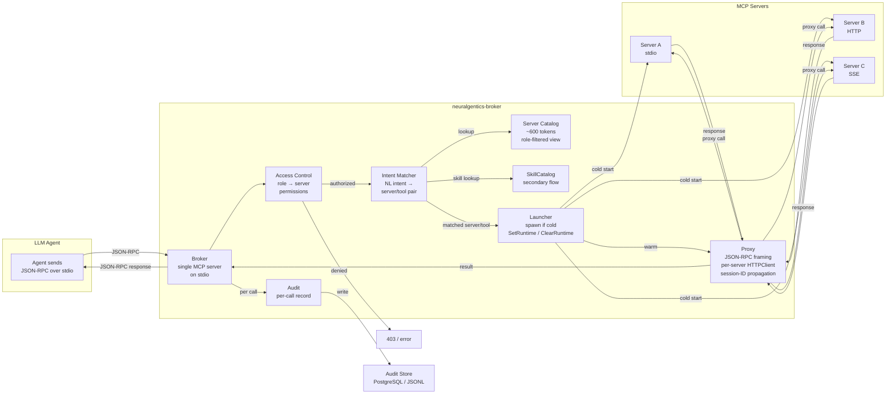

# Architecture

The broker is a long-running daemon that sits between an MCP client (an LLM
agent) and one or more MCP servers. It owns three responsibilities:
spawning/supervising servers, proxying JSON-RPC, and recording every tool
call.

First-class MCP servers (memini-ai) are registered directly in
`opencode.json` and bypass the broker entirely. Everything else sits behind
the broker: catalog-advertised, access-controlled, brokered on demand.

## Three-layer design

The broker is organized as three cooperating layers.

1. **Server catalog** — builds a role-filtered view of every available
   server (and skill). Lives in `src/neuralgentics/broker/catalog/`. The
   catalog is what the routing layer consults to decide which server can
   satisfy a request.
2. **Intent matcher** — given a natural-language intent and a role, picks
   the best server/tool pair to handle it. Lives in
   `src/neuralgentics/broker/intent/`. The matcher is the front door for
   free-text routing.
3. **Access control** — gates which roles can see which servers and call
   which tools. Lives in `src/neuralgentics/broker/access/`. Every catalog
   read and every `Call` go through access control before reaching a
   server.

<!-- mermaid: call-flow -->

## JSON-RPC stdio proxy

The broker itself presents as a single MCP server on stdio. A client (the
LLM agent) opens one JSON-RPC connection to the broker; the broker fans
requests out to the configured servers over their own transports (stdio,
HTTP, or SSE) and returns results on the shared stdio connection.

The proxy layer lives in `src/neuralgentics/broker/proxy/`. It owns:

- the JSON-RPC framing on the client-facing side
- per-server `HTTPClient` instances that respect `EGRESS_GATEWAY_URL`
- session-ID propagation so a downstream egress gateway can correlate
  requests back to the originating session

## Launcher lifecycle

The launcher (`src/neuralgentics/broker/launcher/`) owns the process
lifecycle of each server subprocess. Responsibilities:

- spawn the subprocess and connect its stdio / HTTP transport
- stamp the resulting `ServerEntry` with the process handle and pipes via
  `SetRuntime` (locked accessor)
- watch the subprocess; on exit, call `ClearRuntime` to atomically nil out
  the process and pipes
- honor `SIGHUP` by draining and restarting only the servers whose config
  changed (5s drain window for in-flight connections)

The locked accessors `SetRuntime` and `ClearRuntime` are the fix for the
T-117.5 data race — see [Audit](audit.md#t-1175-race-fix-note) for the
background and why every read of the process handle and pipes goes through
the entry mutex.